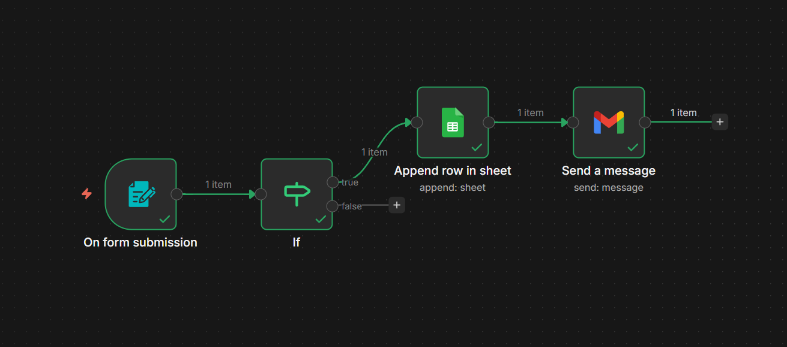

# LeadFlow | Automated Lead Capture

## Overview
An automation workflow that captures leads from a web form, saves them to Google Sheets, and sends instant email notifications — built with n8n.

## Tech Stack
- **n8n** — workflow automation
- **Google Sheets** — lead data storage
- **Gmail API** — email notifications
- **Webhooks** — real time form trigger

## How it works
1. User fills in the contact form
2. n8n receives the data via form trigger
3. IF node validates the email
4. Lead data is saved to Google Sheets
5. Notification email is sent via Gmail

## Workflow Diagram
